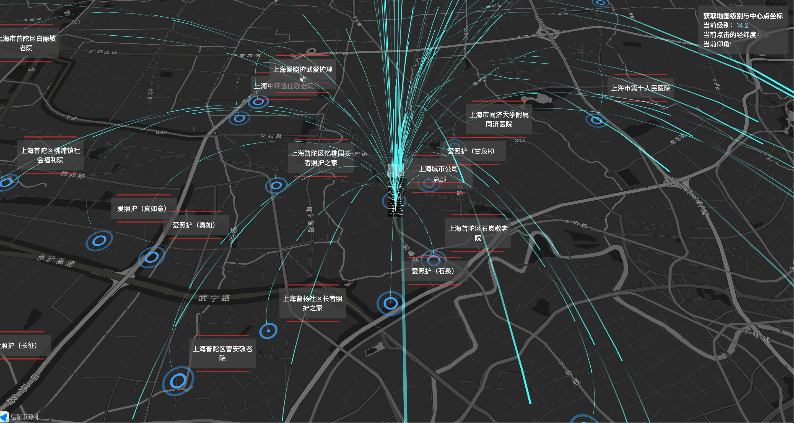
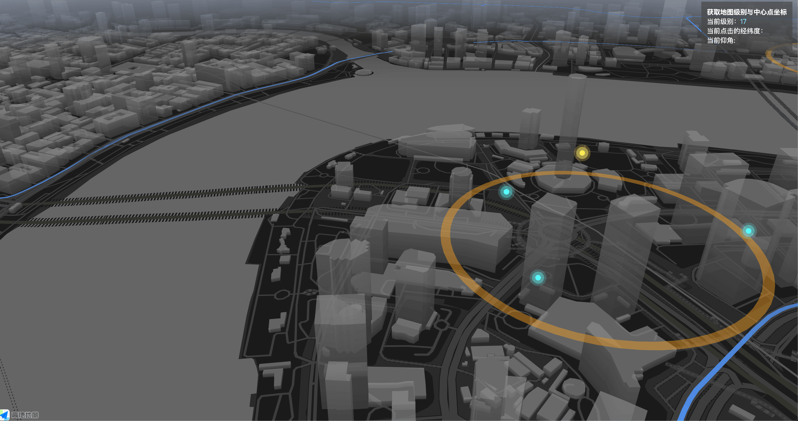
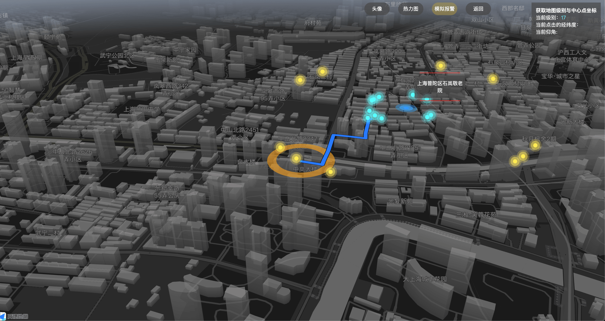
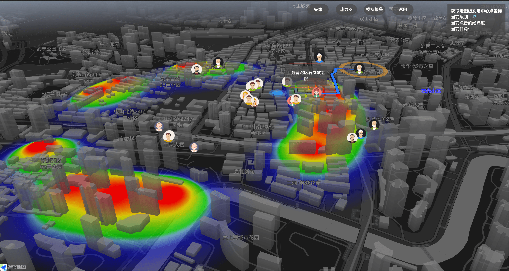

# iacc-map 一个基于 AntV 和高德地图 jssdk 的 3D 调度地图

# 注意：
* 1、项目需要使用 node 12.14.0 版本（不可达到或高于16.0.0），yarn 可使用 1.22.17版本
* 2、项目构建过程会很慢，十分钟或以上，构建未完成前均无法正常访问项目，没有报错则耐心等待

> iacc 的意思是指社区居家养老的缩写，iacc-map 这个是我之前做的一个基于地理位置的大屏实时调度地图项目，
> 目前开源的部分大部分经过脱敏，以及项目早期的代码

## 运行地址:

https://doublenian.github.io/iacc-map/

### 下面看一下运行的截图










### 本地运行

只需要

```
npm install // or  yarn install
```

然后

```
npm run dev
```

就可以看到效果了
